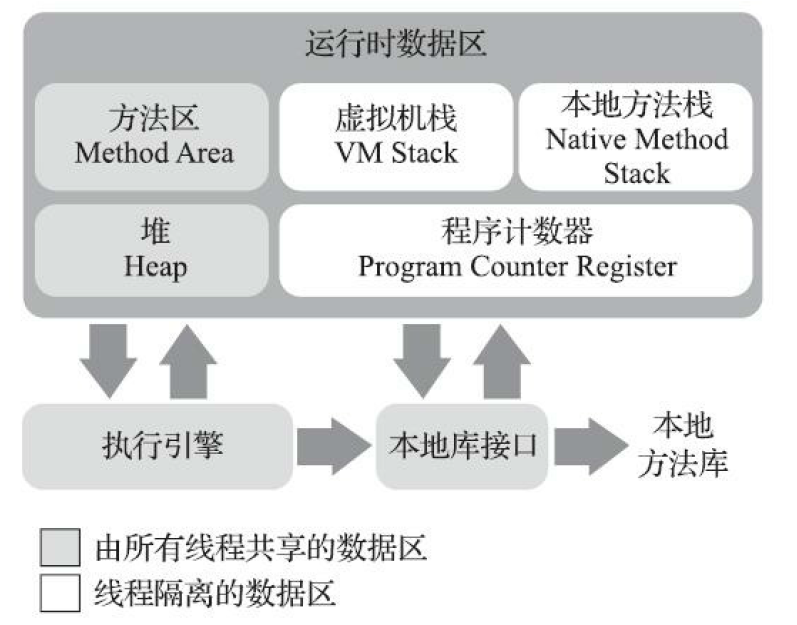
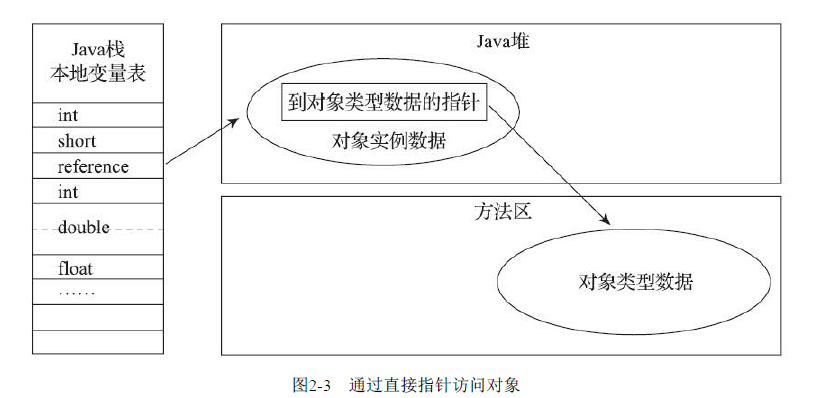

第2章-Java内存区域与内存溢出异常-读书笔记

### 2.2 运行时数据区域

Java虚拟机运行时数据区

#### 程序计数器

程序计数器（Program Counter Register）是一块较小的内存空间，它可以看作是当前线程所执行的
字节码的行号指示器。

#### 虚拟机栈

虚拟机栈描述的是Java方法执行的线程内存模型：每个方法被执行的时候，Java虚拟机都
会同步创建一个栈帧[1]（Stack Frame）用于存储局部变量表、操作数栈、动态连接、方法出口等信
息。每一个方法被调用直至执行完毕的过程，就对应着一个栈帧在虚拟机栈中从入栈到出栈的过程。

#### 本地方法栈

本地方法栈（Native Method Stacks）与虚拟机栈所发挥的作用是非常相似的，其区别只是虚拟机
栈为虚拟机执行Java方法（也就是字节码）服务，而**本地方法栈则是为虚拟机使用到的本地（Native）**
**方法服务**。

#### Java堆

Java堆（Java Heap）是虚拟机所管理的内存中最大的一块。Java堆是被**所**
**有线程共享的一块内存区域**，在虚拟机启动时创建。此内存区域的唯一目的就是存放对象实例，Java
世界里“几乎”所有的对象实例都在这里分配内存。在《Java虚拟机规范》中对Java堆的描述是：“**所有**
**的对象实例以及数组都应当在堆上分配**。

线程共享的Java堆中可以划分出多个线程私有的分配缓冲区（Thread Local Allocation Buffer，**TLAB**）

每个线程在Java堆中预先分配一小块内存，称为本地线程分配缓冲（Thread Local Allocation
Buffer，TLAB），哪个线程要分配内存，就在哪个线程的本地缓冲区中分配，只有本地缓冲区用完
了，分配新的缓存区时才需要同步锁定。虚拟机是否使用TLAB，可以通过-XX：+/-UseTLAB参数来
设定。

#### 方法区

方法区（Method Area）与Java堆一样，是各个线程共享的内存区域，它用于存储已被虚拟机加载
的类型信息、常量、静态变量、即时编译器编译后的代码缓存等数据。虽然《Java虚拟机规范》中把
方法区描述为堆的一个逻辑部分，但是它却有一个别名叫作**“非堆”（Non-Heap）**，目的是与Java堆区
分开来。

### 2.3 HotSpot虚拟机对象探秘

#### 对象的访问定位

使用直接指针来访问最大的好处就是速度更快，它节省了一次指针定位的时间开销，由于对象访
问在Java中非常频繁，因此这类开销积少成多也是一项极为可观的执行成本，就本书讨论的主要虚拟
机HotSpot而言，它主要使用第二种方式进行对象访问。

不可扩展（将堆的最小值-Xms参数与最大值-Xmx参数
设置为一样即可避免堆自动扩

#### 2.4.2　虚拟机栈和本地方法栈溢出

1）如果线程请求的栈深度大于虚拟机所允许的最大深度，将抛出StackOverflowError异常。
2）如果虚拟机的栈内存允许动态扩展，当扩展栈容量无法申请到足够的内存时，将抛出
OutOfMemoryError异常。

内存溢出 out of memory，是指程序在申请内存时，没有足够的内存空间供其使用，出现out of memory；比如申请了一个integer,但给它存了long才能存下的数，那就是内存溢出。

内存泄露 memory leak，是指程序在申请内存后，无法释放已申请的内存空间，一次内存泄露危害可以忽略，但内存泄露堆积后果很严重，无论多少内存,迟早会被占光。

memory leak会最终会导致out of memory！

#### 2.4.3　方法区和运行时常量池溢出

String::intern()是一个本地方法，它的作用是如果字符串常量池中已经包含一个等于此String对象的
字符串，则返回代表池中这个字符串的String对象的引用；否则，会将此String对象包含的字符串添加
到常量池中，并且返回此String对象的引用。

### 2.5　本章小结

到此为止，我们明白了虚拟机里面的内存是如何划分的，哪部分区域、什么样的代码和操作可能
导致内存溢出异常。虽然Java有垃圾收集机制，但内存溢出异常离我们并不遥远，本章只是讲解了各
个区域出现内存溢出异常的原因，下一章将详细讲解Java垃圾收集机制为了避免出现内存溢出异常都
做了哪些努力。